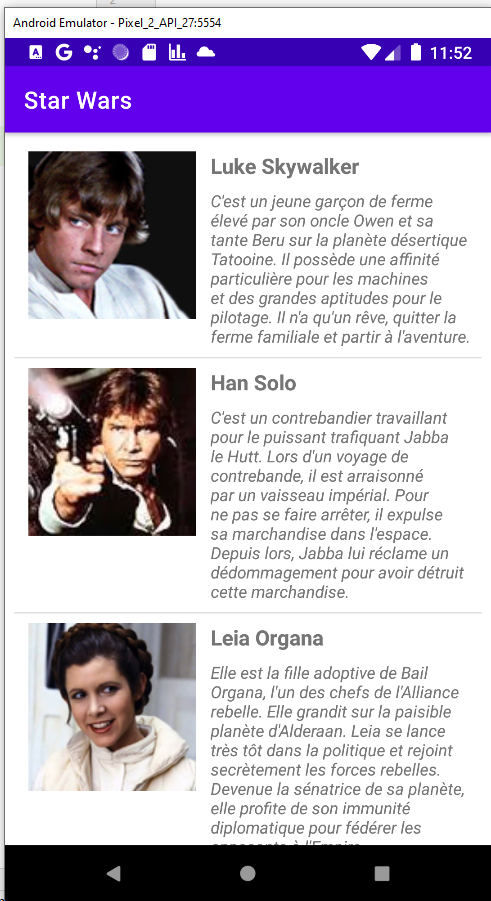

## Starwars List view layount Android Studio

 

### Project Mock-up

* [Mock-UP]()

### Current Project State

* [Project-state]()

### Project Ressources
* main
        - [main](../StarWars/app/src/main/)

# IMPORTANT FILES
* main java
        - [MainActivity.java](../StarWars/app/src/main/java/ca/collegelacite/starwars/MainActivity.java)
* Personnage java
        - [Personnage.java](../StarWars/app/src/main/java/ca/collegelacite/starwars/Personnage.java)  
* PersonnageAdapter java
        - [PersonnageAdapter.java](../StarWars/app/src/main/java/ca/collegelacite/starwars/PersonnageAdapter.java)  

* main xml - [AndroidMainifest.xml](../StarWars/app/src/main/AndroidManifest.xml)   

* ressource layout -[activity_main.xml](../StarWars/app/src/main/res/layout/activity_main.xml)
* ressource layout -[personnage_list_item.xml](../StarWars/app/src/main/res/layout/personnage_list_item.xml)

* personnages json -[personnages.json](../StarWars/app/src/main/assets/personnages.json)
* values strings -[strings.xml](../StarWars/app/src/main/res/values/strings.xml)

##  Material Design 3

* [Material-Design-3](https://m3.material.io/)

##  ALL my ressources for Evaluation 08.1 List view Android Studio

You can have access to the ressources of my Starwars List view layount Android Studio Web Page [this the link](https://github.com/MiguelJerome/StarWars) 
